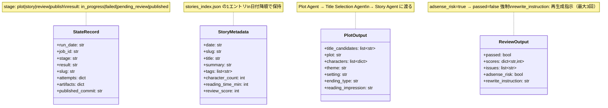

# クラス図

## 全体クラス図

```mermaid
classDiagram
    %% ─────────────────────────────────────────
    %% エントリポイント・オーケストレーター
    %% ─────────────────────────────────────────

    class RunDailyPipeline {
        -config: Config
        -state: StateManager
        -logger: LogManager
        +run()
        +resume_from_stage(stage: str)
        -execute_plot_stage()
        -execute_story_stage()
        -execute_review_stage()
        -execute_publish_stage()
        -handle_failure(stage: str, error: Exception)
    }

    class PublishStoryScript {
        -config: Config
        -state: StateManager
        -logger: LogManager
        +run()
        -sync_posts(slug: str, date: str)
        -update_index(entry: StoryMetadata)
        -git_commit_push() str
        -mark_published(commit_hash: str)
    }

    %% ─────────────────────────────────────────
    %% 設定・状態管理
    %% ─────────────────────────────────────────

    class Config {
        +publication_mode: str
        +max_review_attempts: int
        +similarity_threshold: float
        +load(path: str)$ Config
    }

    class StateManager {
        -path: str
        +load() StateRecord
        +save(record: StateRecord)
        +update(stage: str, result: str, **kwargs)
        +is_today_done(run_date: str) bool
        +get_resume_point() tuple~str,str~
    }

    class StateRecord {
        +run_date: str
        +job_id: str
        +stage: str
        +result: str
        +slug: str
        +attempts: dict
        +artifacts: dict
        +published_commit: str
    }

    %% stage enum: plot | story | review | publish
    %% result enum: in_progress | failed | pending_review | published

    %% ─────────────────────────────────────────
    %% AI エージェント
    %% ─────────────────────────────────────────

    class PlotAgent {
        -prompt_path: str
        -codex: CodexCLI
        +generate(stories_index: list, used_themes: list, banned_terms: list) PlotOutput
        -build_prompt(stories_index: list, used_themes: list, banned_terms: list) str
        -validate(raw: str) PlotOutput
    }

    class TitleSelectionAgent {
        -prompt_path: str
        -codex: CodexCLI
        +select(plot: PlotOutput, recent_titles: list) TitleSelectionOutput
        -build_prompt(plot: PlotOutput, recent_titles: list) str
        -validate(raw: str) TitleSelectionOutput
    }

    class StoryAgent {
        -prompt_path: str
        -codex: CodexCLI
        +generate(plot: PlotOutput, selected_title: str, rewrite_instruction: str) StoryOutput
        -build_prompt(plot: PlotOutput, selected_title: str, rewrite_instruction: str) str
        -validate(raw: str) StoryOutput
    }

    class ReviewAgent {
        -prompt_path: str
        -codex: CodexCLI
        -jaccard: JaccardChecker
        +review(story: StoryOutput, banned_terms: list, recent_30: list) ReviewOutput
        -build_prompt(story: StoryOutput, jaccard_result: dict, banned_terms: list, recent_30: list) str
        -validate(raw: str) ReviewOutput
    }

    class CodexCLI {
        -executable: str
        +run(prompt: str) str
    }

    %% ─────────────────────────────────────────
    %% エージェント出力 JSON モデル
    %% ─────────────────────────────────────────

    class PlotOutput {
        +title_candidates: list~str~
        +plot: str
        +characters: list~dict~
        +theme: str
        +setting: str
        +ending_type: str
        +reading_impression: str
    }

    class TitleSelectionOutput {
        +selected_title: str
        +reason: str
        +scores: dict~str,int~
    }

    class StoryOutput {
        +title: str
        +body: str
        +character_count: int
        +reading_time_min: int
        +summary: str
        +tags: list~str~
    }

    class ReviewOutput {
        +passed: bool
        +scores: dict~str,int~
        +issues: list~str~
        +adsense_risk: bool
        +rewrite_instruction: str
    }

    %% ─────────────────────────────────────────
    %% データストア
    %% ─────────────────────────────────────────

    class StoriesIndex {
        -path: str
        +load() list~StoryMetadata~
        +get_recent(n: int) list~StoryMetadata~
        +atomic_update(entry: StoryMetadata)
    }

    class StoryMetadata {
        +date: str
        +slug: str
        +title: str
        +summary: str
        +tags: list~str~
        +character_count: int
        +reading_time_min: int
        +review_score: int
    }

    class UsedThemes {
        -path: str
        +load() list~dict~
        +get_recent_90days() list~str~
        +add(theme: str, date: str)
    }

    class BannedTerms {
        -path: str
        +load() list~str~
    }

    %% ─────────────────────────────────────────
    %% ファイル操作
    %% ─────────────────────────────────────────

    class StoryFile {
        -stories_dir: str
        -pending_dir: str
        -posts_dir: str
        +save_master(story: StoryOutput, meta: StoryMetadata, date: str) str
        +verify(path: str) bool
        +copy_to_pending(slug: str, date: str)
        +sync_to_posts(slug: str, date: str)
        -build_front_matter(story: StoryOutput, meta: StoryMetadata) str
    }

    class LogManager {
        -base_dir: str
        -run_date: str
        +save_run_log(message: str)
        +save_plot_json(plot: PlotOutput)
        +save_selected_title_json(title: TitleSelectionOutput)
        +save_generation_txt(story: StoryOutput)
        +save_review_json(review: ReviewOutput, attempt: int)
    }

    %% ─────────────────────────────────────────
    %% ユーティリティ
    %% ─────────────────────────────────────────

    class JaccardChecker {
        -threshold: float
        +char_ngrams(text: str, n: int) set~str~
        +jaccard(a: str, b: str) float
        +is_too_similar(candidate: str, recent_30: list~str~) bool
    }

    class GitOperations {
        -repo_path: str
        +add_all()
        +commit(message: str) str
        +push() bool
        +get_last_commit_hash() str
    }

    class WindowsNotifier {
        +notify(title: str, message: str)
        -build_cmd(title: str, message: str) str
    }

    %% ─────────────────────────────────────────
    %% 関連
    %% ─────────────────────────────────────────

    RunDailyPipeline --> Config
    RunDailyPipeline --> StateManager
    RunDailyPipeline --> LogManager
    RunDailyPipeline --> PlotAgent
    RunDailyPipeline --> TitleSelectionAgent
    RunDailyPipeline --> StoryAgent
    RunDailyPipeline --> ReviewAgent
    RunDailyPipeline --> StoryFile
    RunDailyPipeline --> StoriesIndex
    RunDailyPipeline --> GitOperations
    RunDailyPipeline --> WindowsNotifier
    RunDailyPipeline --> UsedThemes
    RunDailyPipeline --> BannedTerms

    PublishStoryScript --> Config
    PublishStoryScript --> StateManager
    PublishStoryScript --> LogManager
    PublishStoryScript --> StoryFile
    PublishStoryScript --> StoriesIndex
    PublishStoryScript --> GitOperations

    StateManager --> StateRecord
    StoriesIndex --> StoryMetadata

    PlotAgent --> PlotOutput
    PlotAgent --> CodexCLI
    TitleSelectionAgent --> TitleSelectionOutput
    TitleSelectionAgent --> CodexCLI
    StoryAgent --> StoryOutput
    StoryAgent --> CodexCLI
    ReviewAgent --> ReviewOutput
    ReviewAgent --> CodexCLI
    ReviewAgent --> JaccardChecker
```

---

## パイプライン処理フロー（クラス間データの流れ）

```mermaid
classDiagram
    direction LR

    class RunDailyPipeline {
        +run()
    }

    class PlotAgent {
        +generate() PlotOutput
    }

    class TitleSelectionAgent {
        +select() TitleSelectionOutput
    }

    class StoryAgent {
        +generate() StoryOutput
    }

    class ReviewAgent {
        +review() ReviewOutput
    }

    class StoryFile {
        +save_master()
        +sync_to_posts()
    }

    class StoriesIndex {
        +atomic_update()
    }

    class GitOperations {
        +commit()
        +push()
    }

    class StateManager {
        +update()
    }

    RunDailyPipeline --> PlotAgent : PlotOutput
    PlotAgent --> TitleSelectionAgent : title_candidates / plot
    TitleSelectionAgent --> StoryAgent : selected_title
    StoryAgent --> ReviewAgent : StoryOutput
    ReviewAgent --> StoryFile : ReviewOutput passed=true
    StoryFile --> StoriesIndex : StoryMetadata
    StoriesIndex --> GitOperations : atomic update done
    GitOperations --> StateManager : commit_hash → published
```

---

## データモデル詳細

```mermaid
classDiagram
    class StateRecord {
        +run_date: str
        +job_id: str
        +stage: str
        +result: str
        +slug: str
        +attempts: dict
        +artifacts: dict
        +published_commit: str
    }
    note for StateRecord "stage: plot|story|review|publish\nresult: in_progress|failed|pending_review|published"

    class StoryMetadata {
        +date: str
        +slug: str
        +title: str
        +summary: str
        +tags: list~str~
        +character_count: int
        +reading_time_min: int
        +review_score: int
    }
    note for StoryMetadata "stories_index.json の1エントリ\n日付降順で保持"

    class PlotOutput {
        +title_candidates: list~str~
        +plot: str
        +characters: list~dict~
        +theme: str
        +setting: str
        +ending_type: str
        +reading_impression: str
    }
    note for PlotOutput "Plot Agent → Title Selection Agent\n→ Story Agent に渡る"

    class ReviewOutput {
        +passed: bool
        +scores: dict~str,int~
        +issues: list~str~
        +adsense_risk: bool
        +rewrite_instruction: str
    }
    note for ReviewOutput "adsense_risk=true → passed=false 強制\nrewrite_instruction: 再生成指示（最大3回）"
```
