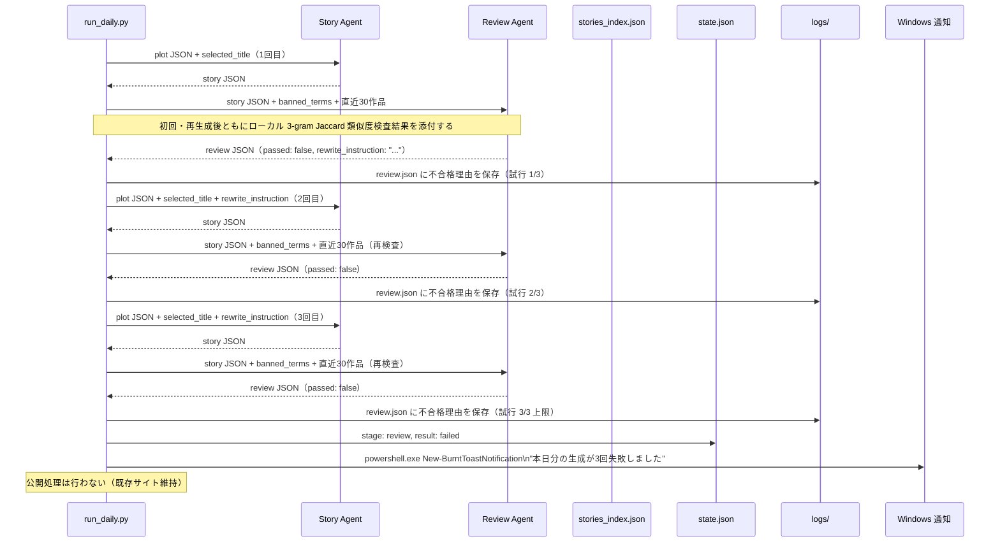
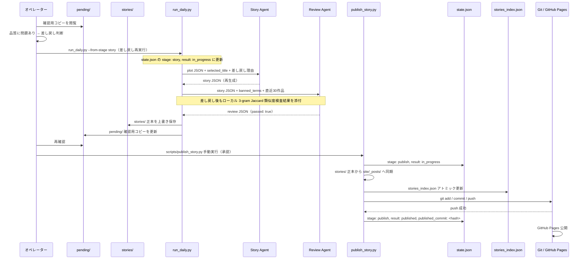
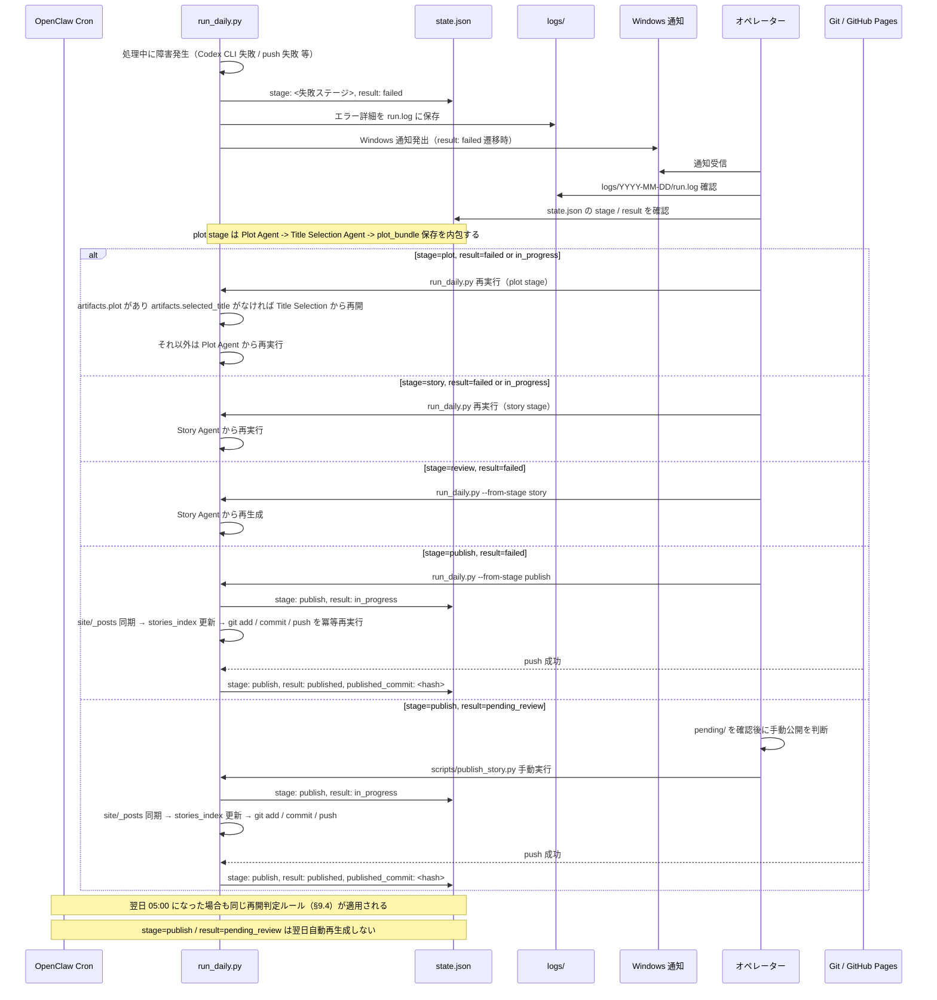
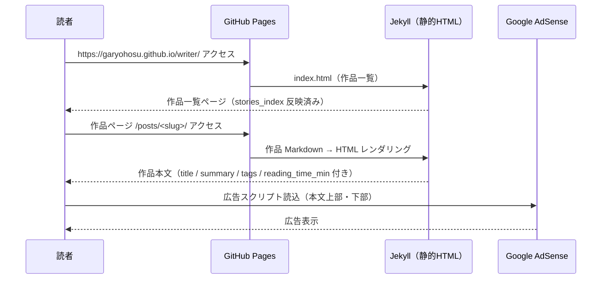

# シーケンス図

## 1. 日次自動実行フロー（automatic モード）

```mermaid
sequenceDiagram
    participant CRON as OpenClaw Cron
    participant MAIN as run_daily.py
    participant STATE as state.json
    participant PLOT as Plot Agent
    participant TITLE as Title Selection Agent
    participant STORY as Story Agent
    participant REVIEW as Review Agent
    participant PUB as Publish Agent
    participant IDX as stories_index.json
    participant GIT as Git / GitHub Pages

    CRON->>MAIN: 05:00 JST 起動
    MAIN->>STATE: 再開判定確認
    STATE-->>MAIN: 未実行 or failed（該当ステージから再開）

    MAIN->>PLOT: plot_prompt.md + stories_index + used_themes + banned_terms
    PLOT-->>MAIN: plot JSON（title_candidates × 3, plot, theme …）
    MAIN->>MAIN: JSON バリデーション

    MAIN->>TITLE: title_candidates × 3 + plot + theme + reading_impression
    TITLE-->>MAIN: selected_title JSON
    MAIN->>MAIN: JSON バリデーション
    MAIN->>MAIN: plot_bundle 保存（plot.json, selected_title.json）

    MAIN->>STORY: plot JSON + selected_title
    STORY-->>MAIN: story JSON（title, body, character_count …）
    MAIN->>MAIN: JSON バリデーション

    MAIN->>REVIEW: story JSON + banned_terms + stories_index（直近30作品）
    Note over MAIN,REVIEW: ローカル 3-gram Jaccard 類似度検査（閾値 0.55）を先行実施
    REVIEW-->>MAIN: review JSON（passed: true, scores …）

    MAIN->>MAIN: stories/YYYY/YYYY-MM-DD-slug.md 正本保存
    MAIN->>MAIN: 正本ファイル検証
    MAIN->>STATE: stage: publish, result: in_progress
    Note over MAIN,STATE: publish は sync_posts -> update_index -> git_commit_push -> mark_published の順で進む
    MAIN->>MAIN: site/_posts/ へ同期
    MAIN->>IDX: stories_index.json アトミック更新（.tmp経由）
    MAIN->>GIT: git add / commit / push
    GIT-->>MAIN: push 成功
    MAIN->>STATE: stage: publish, result: published, published_commit: <hash>
    MAIN->>MAIN: ログ保存（run.log, review.json, generation.txt）
    GIT->>GIT: GitHub Pages ビルド・公開
```

---

## 2. 日次自動実行フロー（manual_review モード）

```mermaid
sequenceDiagram
    participant CRON as OpenClaw Cron
    participant MAIN as run_daily.py
    participant STATE as state.json
    participant PLOT as Plot Agent
    participant TITLE as Title Selection Agent
    participant STORY as Story Agent
    participant REVIEW as Review Agent
    participant PENDING as pending/
    participant OPE as オペレーター
    participant PUB as publish_story.py
    participant IDX as stories_index.json
    participant GIT as Git / GitHub Pages

    CRON->>MAIN: 05:00 JST 起動
    MAIN->>STATE: 再開判定確認
    STATE-->>MAIN: 未実行

    MAIN->>PLOT: plot_prompt.md + 入力データ
    PLOT-->>MAIN: plot JSON
    MAIN->>TITLE: title_candidates + plot
    TITLE-->>MAIN: selected_title JSON
    MAIN->>MAIN: plot_bundle 保存（plot.json, selected_title.json）
    MAIN->>STORY: plot JSON + selected_title
    STORY-->>MAIN: story JSON
    MAIN->>REVIEW: story JSON + banned_terms + 直近30作品
    Note over MAIN,REVIEW: 毎回レビュー前にローカル 3-gram Jaccard 類似度検査を実施し、その結果も渡す
    REVIEW-->>MAIN: review JSON（passed: true）

    MAIN->>MAIN: stories/YYYY/YYYY-MM-DD-slug.md 正本保存
    MAIN->>MAIN: 正本ファイル検証
    MAIN->>STATE: stage: publish, result: in_progress
    MAIN->>PENDING: pending/YYYY/YYYY-MM-DD-slug.md 確認用コピー作成
    MAIN->>STATE: stage: publish, result: pending_review
    MAIN->>MAIN: ログ保存（自動停止 ※push しない）

    Note over OPE: Windows 通知なし（pending_review は正常停止）
    OPE->>PENDING: 確認用コピーを閲覧・確認
    OPE->>PUB: scripts/publish_story.py 手動実行

    PUB->>STATE: stage: publish, result: in_progress
    PUB->>PUB: stories/ 正本から site/_posts/ へ同期
    PUB->>IDX: stories_index.json アトミック更新
    PUB->>GIT: git add / commit / push
    GIT-->>PUB: push 成功
    PUB->>STATE: stage: publish, result: published, published_commit: <hash>
    GIT->>GIT: GitHub Pages ビルド・公開
```

---

## 3. レビュー不合格・再生成フロー



---

## 4. オペレーターによる差し戻し・再生成フロー



---

## 5. 障害・復旧フロー



---

## 6. 読者によるサイト閲覧フロー


