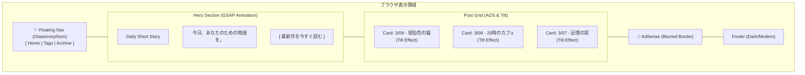

# ui.md (Rich & Modern Edition)

## DailyShortStorySite UI/UX デザイン設計書

**Concept:** "Ethereal Narrative"（日常に溶け込む幻想的な物語体験）  
**Theme:** Jekyll + Chirpy (Customized)  
**Visual Identity:** 
- **Style:** Glassmorphism & Micro-Interactions
- **Color:** Deep Indigo / Soft Amber (Dark/Light 共通のアクセント)
- **Animation:** Scroll-triggered reveals, Staggered entries, Hover-tilt effects

---

## 1. 視覚演出・外部ライブラリ (CDN 利用)

リッチな体験を実現するために以下のライブラリを `head` または `footer` で読み込みます。

| ライブラリ | 用途 | 効果 |
|---|---|---|
| **AOS (Animate On Scroll)** | スクロール連動 | 記事カードがふわっと浮き上がるように出現 |
| **GSAP** | ヒーローセクション演出 | タイトルの文字が1文字ずつ流れるように表示 |
| **Vanilla-tilt.js** | 3D ホバー効果 | 記事カードにマウスを乗せると立体的に傾く |
| **Google Fonts (Inter/Poppins)** | タイポグラフィ | モダンで可読性の高い欧文・和文フォント |
| **Font Awesome 6** | アイコン | リッチな各種ボタン・ナビゲーション用 |

---

## 2. ページ別詳細演出設計

### 2.1 トップページ：圧倒的な「入り口」

#### ヒーローセクション (Animated Hero)
- **背景:** わずかに動くグラデーションメッシュ（CSS アニメーション）。
- **タイトル演出:** GSAP を使い、ページロード時に「Daily Short Story」の文字が下からスライドアップ。
- **キャッチコピー:** 「今日、あなたのための物語を。」をフェードイン表示。

#### 記事カード (Interactive Cards)
- **Glassmorphism:** 背景を `backdrop-filter: blur(10px)` で透過。
- **AOS 連携:** スクロールするたびに、左右交互にカードがフェードイン（`data-aos="fade-up"`）。
- **Hover Tilt:** マウスホバーでカードが3Dに傾き、影が強調される演出。

### 2.2 記事詳細：物語に没入させる演出

#### 読了ゲージ (Reading Progress Bar)
- ページ上部に、読んでいる位置に合わせて伸びる「物語の進捗バー」を配置。
- 色は Soft Amber（琥珀色）で、物語が進むにつれて光るエフェクト。

#### 本文の出現 (Staggered Text Reveal)
- 本文の段落ごとに、スクロールに合わせてわずかに透明度と位置が変わるアニメーションを適用。
- 「読み進める楽しさ」を視覚的にサポート。

#### AI 署名バナー
- 記事末尾に、AIが生成したことを示すスタイリッシュなバッジを配置。ホバーすると「生成プロセス（Plot -> Story -> Review）」のアイコンがアニメーション。

---

## 3. ページレイアウト（ワイヤーフレーム更新）

### 3.1 統合デザイン：トップページ



---

## 4. アニメーション・トリガー定義

実装時に適用する `data-aos` 属性のルール：

| 要素 | アニメーション種類 | 遅延(ms) | 備考 |
|---|---|---|---|
| ヘッダー | `fade-down` | 0 | ページ上部から固定 |
| ヒーロータイトル | `gsap.from` | 200 | 1文字ずつ `y: 50, opacity: 0` |
| 記事カード1〜3 | `fade-up` | 100/200/300 | 段階的に表示（Staggered） |
| AdSense 枠 | `zoom-in` | 500 | 少し遅れて出現し注目を集める |
| フッター | `fade-in` | 0 | 最後にひっそりと出現 |

---

## 5. CSS 変数（デザインシステム）

モダンな外観を維持するためのカラーパレット設定：

```css
:root {
  /* モダンなダーク/ライト兼用パレット */
  --primary-accent: #ffb347; /* Soft Amber (琥珀) */
  --bg-gradient: linear-gradient(135deg, #0f172a 0%, #1e293b 100%);
  --glass-bg: rgba(255, 255, 255, 0.05);
  --glass-border: rgba(255, 255, 255, 0.1);
  --text-main: #f8fafc;
  --text-muted: #94a3b8;
  
  /* アニメーション定数 */
  --transition-smooth: all 0.4s cubic-bezier(0.25, 1, 0.5, 1);
}
```

---

## 6. AdSense との調和

リッチなデザインを壊さないための広告配置：
- **広告枠の境界線:** 鋭い境界線を避け、非常に薄い `1px solid var(--glass-border)` と微細な `box-shadow` を適用。
- **広告ラベル:** 「Advertisement」の文字を小さく、洗練されたフォントで表示。
- **余白の美:** 広告の上下に十分なホワイトスペース（またはダークスペース）を確保し、コンテンツとの「格」を分ける。

---

## 7. ユーザー体験（UX）の驚きポイント

1.  **ダークモードのシームレスな切り替え:**
    - 切り替え時に画面が「波紋が広がるように」色が変わる演出。
2.  **物語への没入（Focus Mode）:**
    - 記事詳細でスクロールを開始すると、ナビゲーションが自動的に隠れ、本文に集中できる環境を構築。
3.  **読了後のご褒美:**
    - 記事を最後まで読むと、小さな星が飛ぶようなパーティクル演出（`canvas-confetti` 等の軽量ライブラリ検討）。
