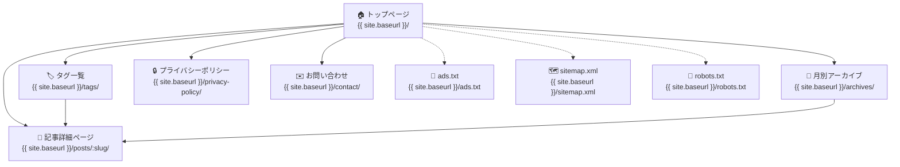
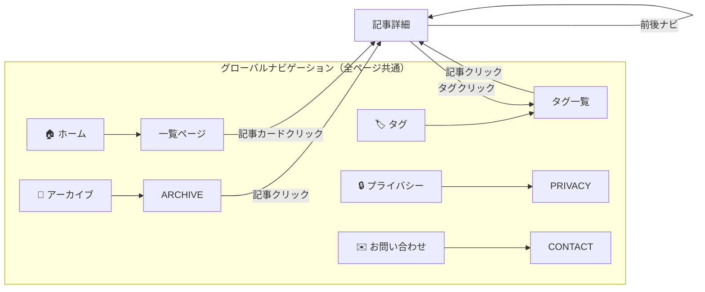
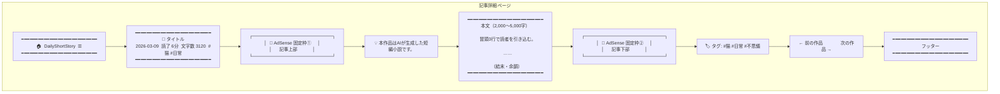
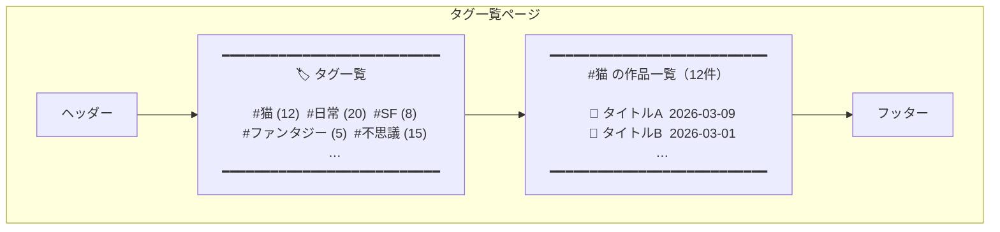
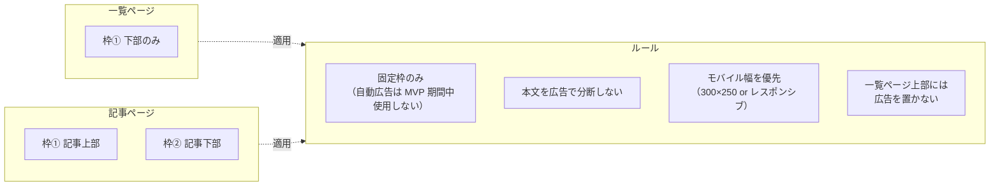
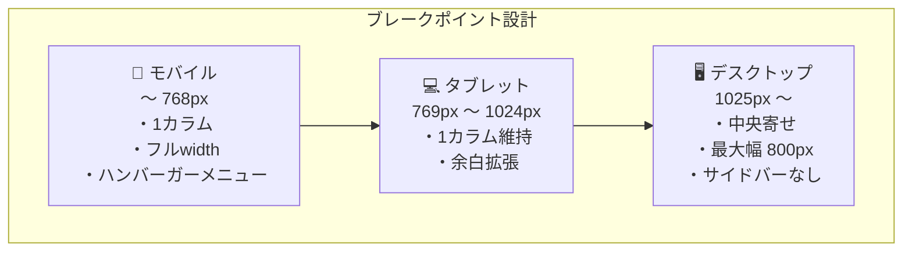
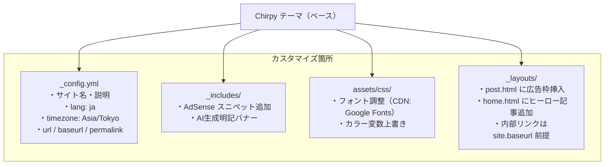
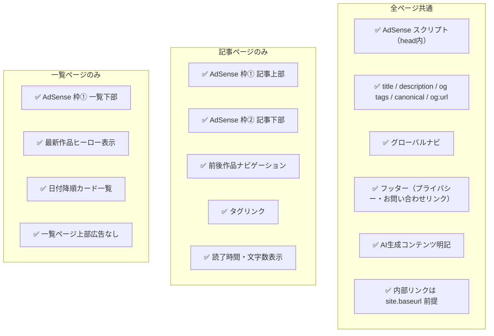

# ui.md
## DailyShortStorySite UI 設計書

**Theme:** Jekyll + Chirpy
**方針:** モバイルファースト・モダン技術ブログ的外観・CDN 利用・AdSense 固定枠3箇所
**URL 前提:** GitHub Pages の project site として運用し、内部リンクは `{{ site.baseurl }}` を前置する

---

## 1. サイト全体構成図（サイトマップ）

---

## 2. ナビゲーション遷移図

---

## 3. トップページ（作品一覧）ワイヤーフレーム

```mermaid
graph TD
    subgraph PAGE["トップページ（モバイル幅 max 768px 基準）"]
        HD["━━━━━━━━━━━━━━━━━━━━━━━━━━━\n🏠  DailyShortStory  ☰\n━━━━━━━━━━━━━━━━━━━━━━━━━━━\nヘッダー / サイト名 / ハンバーガーメニュー"]

        HERO["━━━━━━━━━━━━━━━━━━━━━━━━━━━\n✨ 最新作品ピックアップ\n『タイトル』\n要約テキスト…  [続きを読む →]\n━━━━━━━━━━━━━━━━━━━━━━━━━━━"]

        CARD1["┌─────────────────────────┐\n│ 2026-03-09  #猫 #日常   │\n│ 📖 タイトルA            │\n│ 要約テキスト（2行）      │\n│ 読了時間 6分  文字数 3120 │\n│ スコア 86                │\n└─────────────────────────┘"]

        CARD2["┌─────────────────────────┐\n│ 2026-03-08  #SF         │\n│ 📖 タイトルB            │\n│ 要約テキスト（2行）      │\n│ 読了時間 5分  文字数 2870 │\n│ スコア 82                │\n└─────────────────────────┘"]

        DOTS["…（日付降順で続く）"]

        AD1["┌─────────────────────────┐\n│  📢 AdSense 固定枠       │\n│      一覧ページ下部      │\n└─────────────────────────┘"]

        FT["━━━━━━━━━━━━━━━━━━━━━━━━━━━\nフッター\nプライバシーポリシー | お問い合わせ\nAI生成コンテンツ明記 | © DailyShortStory\n━━━━━━━━━━━━━━━━━━━━━━━━━━━"]
    end

    HD --> HERO --> CARD1 --> CARD2 --> DOTS --> AD1 --> FT
```

---

## 4. 記事詳細ページワイヤーフレーム

---

## 5. タグ一覧ページワイヤーフレーム

---

## 6. AdSense 配置まとめ

---

## 7. レスポンシブ対応方針

---

## 8. Chirpy テーマ カスタマイズ方針

---

## 9. 各ページ必須要素チェックリスト

