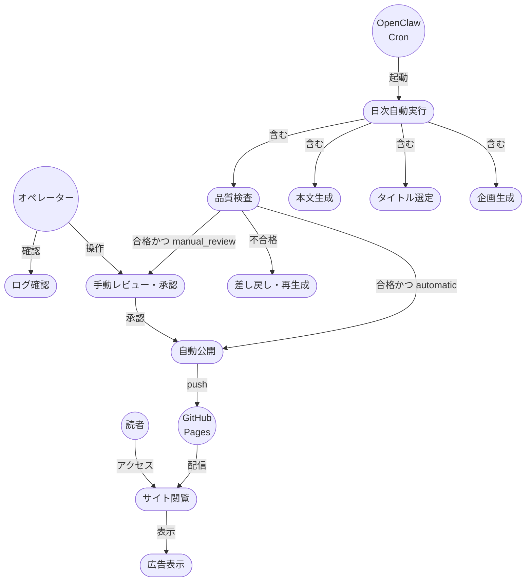
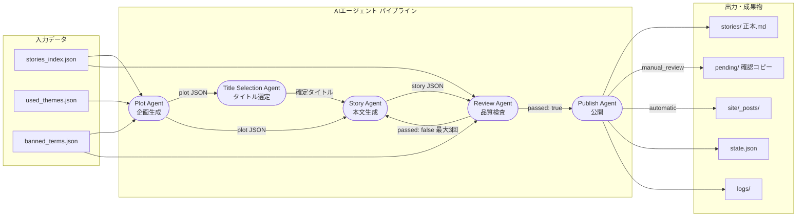
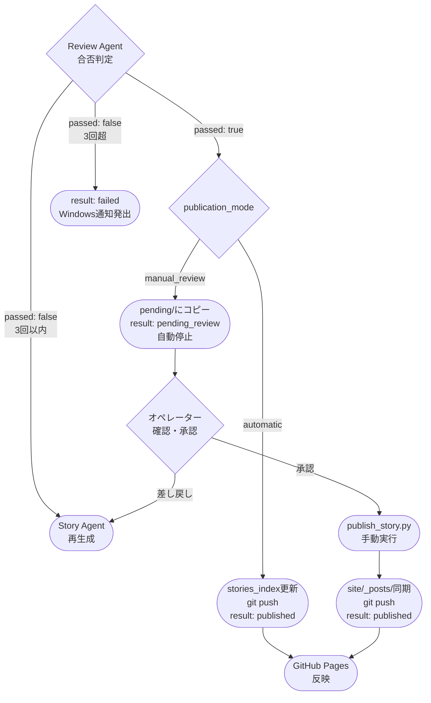
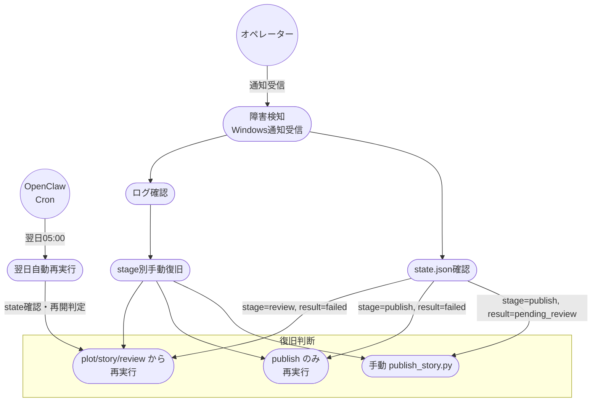

# ユースケース図

## 1. システム全体ユースケース

```mermaid
graph TD
    CRON((OpenClaw\nCron))
    OPE((オペレーター))
    READER((読者))
    PAGES((GitHub\nPages))

    UC1([日次自動実行])
    UC2([企画生成])
    UC3([タイトル選定])
    UC4([本文生成])
    UC5([品質検査])
    UC6([自動公開])
    UC7([手動レビュー・承認])
    UC8([差し戻し・再生成])
    UC9([ログ確認])
    UC10([サイト閲覧])
    UC11([広告表示])

    CRON -->|起動| UC1
    UC1 -->|含む| UC2
    UC1 -->|含む| UC3
    UC1 -->|含む| UC4
    UC1 -->|含む| UC5
    UC5 -->|合格かつ automatic| UC6
    UC5 -->|不合格| UC8
    UC5 -->|合格かつ manual_review| UC7
    UC7 -->|承認| UC6
    OPE -->|操作| UC7
    OPE -->|確認| UC9
    UC6 -->|push| PAGES
    PAGES -->|配信| UC10
    READER -->|アクセス| UC10
    UC10 -->|表示| UC11
```

---

## 2. AIエージェント パイプライン詳細

```mermaid
graph LR
    subgraph Input["入力データ"]
        IDX[stories_index.json]
        THEMES[used_themes.json]
        BANNED[banned_terms.json]
    end

    subgraph Agents["AIエージェント パイプライン"]
        PA([Plot Agent\n企画生成])
        TA([Title Selection Agent\nタイトル選定])
        SA([Story Agent\n本文生成])
        RA([Review Agent\n品質検査])
        PUB([Publish Agent\n公開])
    end

    subgraph Output["出力・成果物"]
        STORY[stories/ 正本.md]
        PENDING[pending/ 確認コピー]
        POSTS[site/_posts/]
        STATE[state.json]
        LOG[logs/]
    end

    IDX --> PA
    THEMES --> PA
    BANNED --> PA
    PA -->|plot JSON| TA
    TA -->|確定タイトル| SA
    PA -->|plot JSON| SA
    SA -->|story JSON| RA
    BANNED --> RA
    IDX --> RA
    RA -->|passed: true| PUB
    RA -->|passed: false 最大3回| SA
    PUB --> STORY
    PUB -->|manual_review| PENDING
    PUB -->|automatic| POSTS
    PUB --> STATE
    PUB --> LOG
```

---

## 3. 公開モード別フロー

```mermaid
graph TD
    REVIEW{Review Agent\n合否判定}
    MODE{publication_mode}

    REVIEW -->|passed: true| MODE
    REVIEW -->|passed: false\n3回以内| REGEN([Story Agent\n再生成])
    REVIEW -->|passed: false\n3回超| FAIL([result: failed\nWindows通知発出])

    MODE -->|manual_review| PENDING([pending/にコピー\nresult: pending_review\n自動停止])
    MODE -->|automatic| AUTO([stories_index更新\ngit push\nresult: published])

    PENDING --> HUMAN{オペレーター\n確認・承認}
    HUMAN -->|承認| MANPUB([publish_story.py\n手動実行])
    HUMAN -->|差し戻し| REGEN

    MANPUB --> PUSH([site/_posts/同期\ngit push\nresult: published])

    AUTO --> PAGES([GitHub Pages\n反映])
    PUSH --> PAGES
```

---

## 4. 障害・復旧ユースケース

```mermaid
graph TD
    OPE((オペレーター))
    CRON((OpenClaw\nCron))

    UC1([障害検知\nWindows通知受信])
    UC2([ログ確認])
    UC3([state.json確認])
    UC4([stage別手動復旧])
    UC5([翌日自動再実行])

    subgraph 復旧判断
        R1([plot/story/review から\n再実行])
        R2([publish のみ\n再実行])
        R3([手動 publish_story.py])
    end

    OPE -->|通知受信| UC1
    UC1 --> UC2
    UC1 --> UC3
    UC3 -->|stage=review, result=failed| R1
    UC3 -->|stage=publish, result=failed| R2
    UC3 -->|stage=publish, result=pending_review| R3
    UC2 --> UC4
    UC4 --> R1
    UC4 --> R2
    UC4 --> R3
    CRON -->|翌日05:00| UC5
    UC5 -->|state確認・再開判定| R1
```
